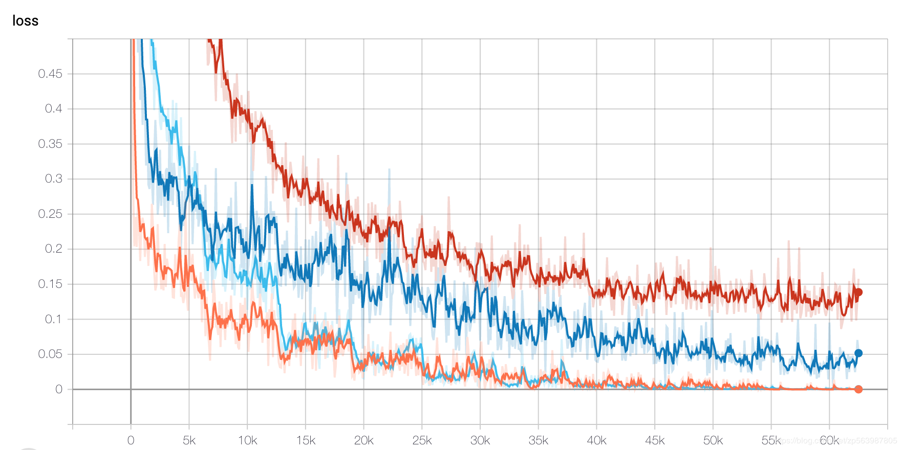

# Multi_Model_Classification
多模型中文新闻文本分类

本文构建了RNN、CNN、AVG、BERT模型做中文新闻cnews文本分类任务，各模型的结果汇总如下：

模型|acc|f1-score|acc_and_f1
:----:|:----:|:----:|:----:
AVG|0.9391|0.9385|0.9388
CNN|0.979|0.9789|0.9790
RNN|0.9676|0.9672|0.9674
BERT|0.9656|0.9654|0.9655

模型loss曲线如下：

综合比较分析：

* 对词向量取平均的AVG模型准确率也能达到0.9391，说明神经网络的拟合能力确实超强，同时AVG模型简单直接性能也不错，可以作为一个baseline选择
* 训练数据集可能比较简单
* CNN模型在数据集上表现最佳，且训练时间最短，说明在简单任务或复杂模型架构中可以加入CNN网络，没必要万事BERT起步
* BERT模型未能达到最佳性能，可能得推测为数据集相对简单。且BERT简单fine-tuning一个epoch指标已经很高，说明BERT在某些简单任务上不做fine-tuning都可以。参考论文To Tune or Not to Tune(https://arxiv.org/abs/1903.05987)
